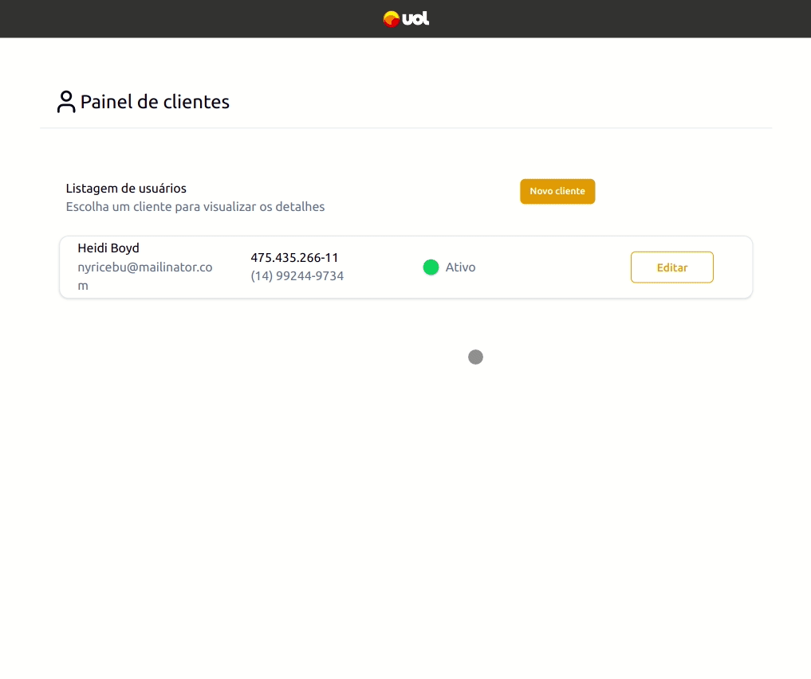
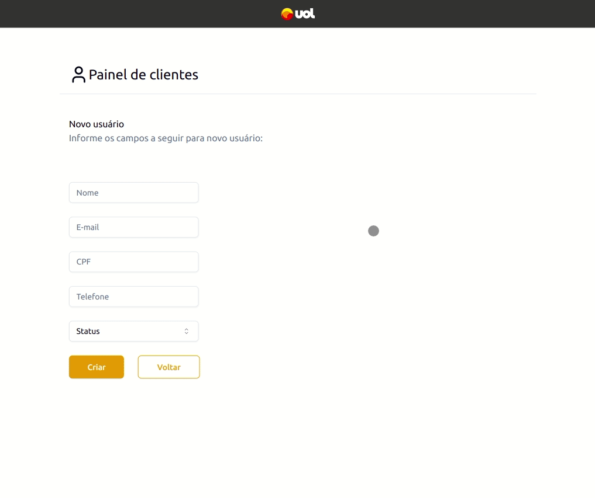

# Gerenciamento de clientes

## Sumário

- [Resumo](#frontend-do-projeto)
- [Configuração local](#configuração-local)
- [Pages](#pages)
  - [Tela inicial](#tela-inicial)
  - [Tela de Edição](#tela-edição)
  - [Tela de Criação](#tela-criação)

# Frontend do projeto

A aplicação frontend foi criada utilizando o framework React com TypeScript e a ferramenta Vite em node.js. Também utilizado bibliotecas zod para validação, shadcn ui para criação de componentes customizados e Tailwind CSS para estilização e responsividade. Além disso, foi usado SWR react Hooks para data fetching.

# Configuração local

1. Clone o repositório do projeto:

```
git clone git@github.com:uoldevs/test-fullstack.git
```

2. Acesse a pasta do projeto:

```
cd test-fullstack
```

3. Mude para branch develop/thais-gonzaga:

```
git checkout develop/thais-gonzaga
```

4. Na raiz do projeto, crie o arquivo .env com as variáveis de ambiente que temos no arquivo .env.exemple

5. Acesse a pasta frontend :

```
cd frontend
```

6. Instale as dependências :

```
npm install
```

7. Inicie a aplicação :

```
npm run dev
```

# Pages

## Tela inicial


## Tela de edição



## Tela de criação


